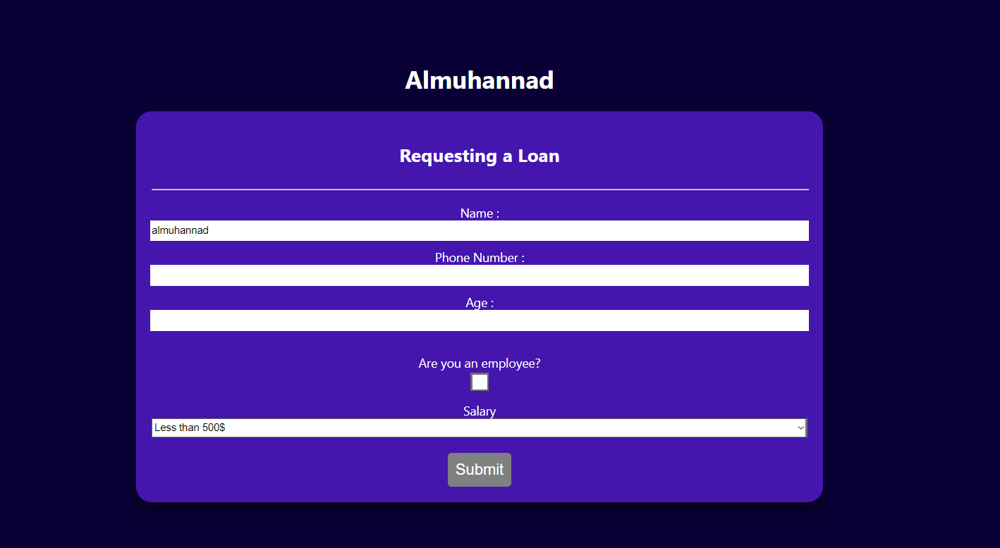
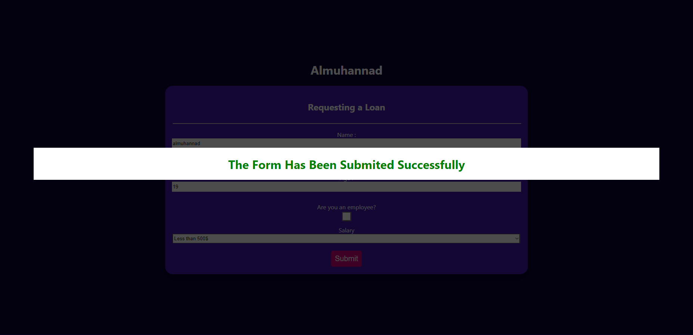
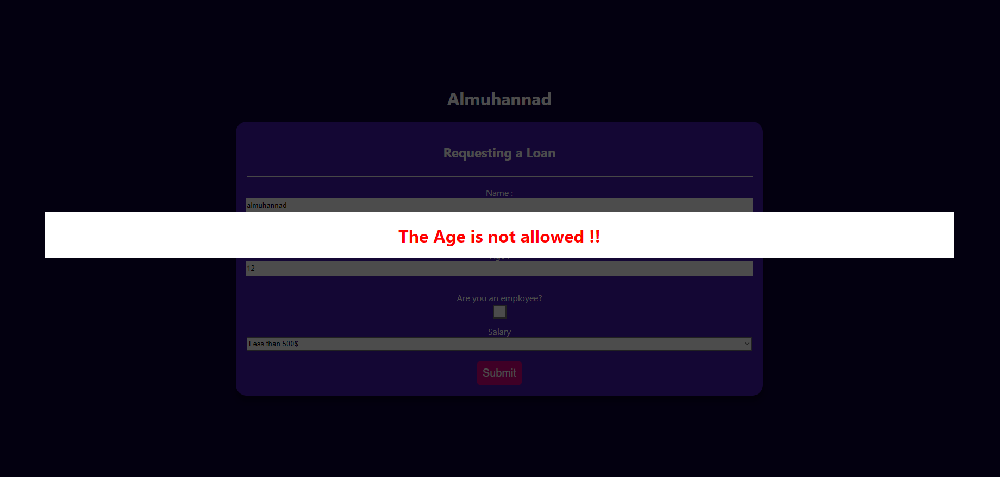

# Loan data entry form 💸..

It is built using *React.js* library.

## A mini-model intended to develop my skills in:
- React Hooks (useState, useContext).
-  Hide the Submit button when you do not complete filling out the important data.
- Show the error message and build it into a separate component.

__(https://64ddd8e198c7355a31083d8b--velvety-palmier-c50b52.netlify.app)__

